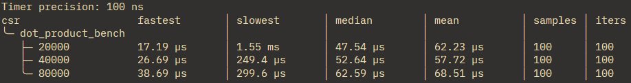
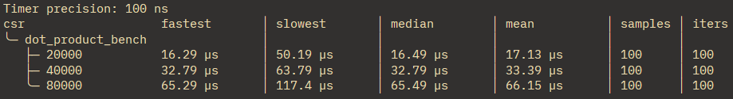
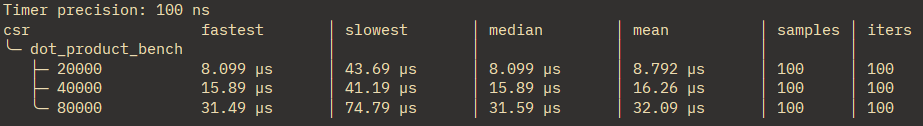

# 벤치 테스트

divan 크레이트를 사용하여 벤치 테스트 진행

## Vector dot product


### method.1

멀티 스레드 + SIMD

```rust
let arch = simd::arch();

// 멀티 스레드 오버헤드 발생
let chunk_size = simd::calculate_chunk_size(len);
let result = self
    .par_chunks(chunk_size)
    .zip(vec.par_chunks(chunk_size))
    .map(|(a, b)| arch.dispatch(simd::VectorDot(a, b)))
    .sum::<f64>();
```



### method.2

싱글 스레드

```rust
let result = self.iter().zip(vec).map(|(a, b)| a * b).sum::<f64>();
```



### method.3

싱글 스레드 + SIMD

```rust
let arch = simd::arch();
let result = arch.dispatch(simd::VectorDot(self, vec));
```


